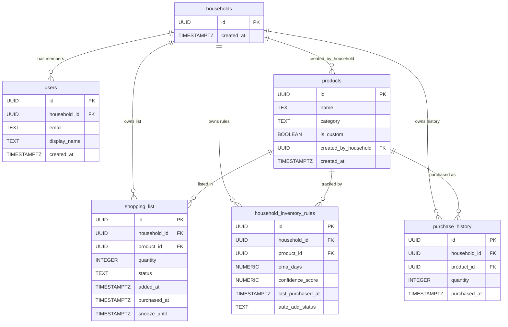

# Agala — Database Documentation

> **Backend:** Supabase (PostgreSQL)
> **Project ref:** `aynippaxcwmqufrnthti`
> **Region:** East US (North Virginia)

---

## ER Diagram



---

## Tables

### 1. `households`

Central multi-tenant entity. Every user belongs to exactly one household; all data is scoped to a household.

| Column       | Type        | Default             | Description         |
| ------------ | ----------- | ------------------- | ------------------- |
| `id`         | UUID (PK)   | `gen_random_uuid()` | Unique household ID |
| `created_at` | TIMESTAMPTZ | `now()`             | Creation timestamp  |

---

### 2. `users`

Linked to Supabase Auth (`auth.users`). Auto-created on signup via the `handle_new_user` trigger.

| Column         | Type          | Default | Description                 |
| -------------- | ------------- | ------- | --------------------------- |
| `id`           | UUID (PK, FK) | —       | References `auth.users(id)` |
| `household_id` | UUID (FK)     | —       | References `households(id)` |
| `email`        | TEXT          | —       | User email                  |
| `display_name` | TEXT          | `NULL`  | Optional display name       |
| `created_at`   | TIMESTAMPTZ   | `now()` | Creation timestamp          |

**Foreign Keys:** `household_id` → `households(id)` ON DELETE CASCADE

---

### 3. `products`

Medium-resolution product catalog. Contains both global seed products (`is_custom = false`) and household-specific custom products.

| Column                 | Type        | Default             | Description                             |
| ---------------------- | ----------- | ------------------- | --------------------------------------- |
| `id`                   | UUID (PK)   | `gen_random_uuid()` | Unique product ID                       |
| `name`                 | TEXT        | —                   | Product name (Hebrew)                   |
| `category`             | TEXT        | `NULL`              | Product category (see categories below) |
| `is_custom`            | BOOLEAN     | `false`             | `true` = household-created product      |
| `created_by_household` | UUID (FK)   | `NULL`              | Household that created this product     |
| `created_at`           | TIMESTAMPTZ | `now()`             | Creation timestamp                      |

**Foreign Keys:** `created_by_household` → `households(id)` ON DELETE SET NULL

---

### 4. `shopping_list`

Active shopping list with full lifecycle: active → purchased / snoozed. Also serves as historical record.

| Column         | Type        | Default             | Constraints                              | Description                       |
| -------------- | ----------- | ------------------- | ---------------------------------------- | --------------------------------- |
| `id`           | UUID (PK)   | `gen_random_uuid()` | —                                        | Unique row ID                     |
| `household_id` | UUID (FK)   | —                   | NOT NULL                                 | References `households(id)`       |
| `product_id`   | UUID (FK)   | —                   | NOT NULL                                 | References `products(id)`         |
| `quantity`     | INTEGER     | `1`                 | NOT NULL                                 | Item quantity                     |
| `status`       | TEXT        | `'active'`          | CHECK (`active`, `purchased`, `snoozed`) | Current item status               |
| `added_at`     | TIMESTAMPTZ | `now()`             | NOT NULL                                 | When item was added to list       |
| `purchased_at` | TIMESTAMPTZ | `NULL`              | —                                        | When item was marked as purchased |
| `snooze_until` | TIMESTAMPTZ | `NULL`              | —                                        | Snooze expiry timestamp           |

**Foreign Keys:**

- `household_id` → `households(id)` ON DELETE CASCADE
- `product_id` → `products(id)` ON DELETE CASCADE

---

### 5. `household_inventory_rules`

AI prediction state per product per household. Stores EMA (Exponential Moving Average) cycle data and confidence scores.

| Column              | Type        | Default             | Constraints                                       | Description                   |
| ------------------- | ----------- | ------------------- | ------------------------------------------------- | ----------------------------- |
| `id`                | UUID (PK)   | `gen_random_uuid()` | —                                                 | Unique rule ID                |
| `household_id`      | UUID (FK)   | —                   | NOT NULL                                          | References `households(id)`   |
| `product_id`        | UUID (FK)   | —                   | NOT NULL                                          | References `products(id)`     |
| `ema_days`          | NUMERIC     | `0`                 | NOT NULL                                          | EMA of days between purchases |
| `confidence_score`  | NUMERIC     | `0`                 | CHECK (`0 ≤ value ≤ 100`)                         | Prediction confidence (0–100) |
| `last_purchased_at` | TIMESTAMPTZ | `NULL`              | —                                                 | Last purchase timestamp       |
| `auto_add_status`   | TEXT        | `'manual_only'`     | CHECK (`auto_add`, `suggest_only`, `manual_only`) | Prediction action level       |

**Unique Constraint:** `(household_id, product_id)` — one rule per product per household

**`auto_add_status` thresholds:**
| Score Range | Status | Behavior |
|-------------|---------------|--------------------------------------------|
| ≥ 85 | `auto_add` | Automatically added to shopping list |
| 50–84 | `suggest_only`| Shown as suggestion chip in UI |
| < 50 | `manual_only` | Still learning, no automatic action |

**Foreign Keys:**

- `household_id` → `households(id)` ON DELETE CASCADE
- `product_id` → `products(id)` ON DELETE CASCADE

---

### 6. `purchase_history`

Immutable transaction log for every purchase. Used for analytics, buy-cycle predictions, and EMA confidence calculations.

| Column         | Type        | Default             | Description                 |
| -------------- | ----------- | ------------------- | --------------------------- |
| `id`           | UUID (PK)   | `gen_random_uuid()` | Unique record ID            |
| `household_id` | UUID (FK)   | —                   | References `households(id)` |
| `product_id`   | UUID (FK)   | —                   | References `products(id)`   |
| `quantity`     | INTEGER     | `1`                 | Quantity purchased          |
| `purchased_at` | TIMESTAMPTZ | `now()`             | Purchase timestamp          |

**Foreign Keys:**

- `household_id` → `households(id)` ON DELETE CASCADE
- `product_id` → `products(id)` ON DELETE CASCADE

---

## Indexes

| Index Name                       | Table                       | Column(s)                                       |
| -------------------------------- | --------------------------- | ----------------------------------------------- |
| `idx_users_household`            | `users`                     | `household_id`                                  |
| `idx_shopping_list_household`    | `shopping_list`             | `household_id`                                  |
| `idx_shopping_list_status`       | `shopping_list`             | `(household_id, status)`                        |
| `idx_inventory_rules_hh`         | `household_inventory_rules` | `household_id`                                  |
| `idx_products_category`          | `products`                  | `category`                                      |
| `idx_purchase_history_household` | `purchase_history`          | `(household_id, purchased_at DESC)`             |
| `idx_purchase_history_product`   | `purchase_history`          | `(household_id, product_id, purchased_at DESC)` |

---

## Row Level Security (RLS)

All tables have RLS enabled. Access is scoped to the user's household via `get_my_household_id()`.

### Helper Function

```sql
CREATE OR REPLACE FUNCTION public.get_my_household_id()
RETURNS UUID
LANGUAGE sql STABLE SECURITY DEFINER
AS $$ SELECT household_id FROM public.users WHERE id = auth.uid(); $$;
```

### Policies by Table

| Table                       | Operation | Policy Name                                       | Rule                                                                  |
| --------------------------- | --------- | ------------------------------------------------- | --------------------------------------------------------------------- |
| `households`                | SELECT    | Users can view own household                      | `id = get_my_household_id()`                                          |
| `households`                | INSERT    | Authenticated users can create a household        | `auth.uid() IS NOT NULL`                                              |
| `users`                     | SELECT    | Users can view household members                  | `household_id = get_my_household_id()`                                |
| `users`                     | INSERT    | Users can insert own profile                      | `id = auth.uid()`                                                     |
| `users`                     | UPDATE    | Users can update own profile                      | `id = auth.uid()`                                                     |
| `products`                  | SELECT    | Users can view products                           | `is_custom = false` OR `created_by_household = get_my_household_id()` |
| `products`                  | INSERT    | Users can insert custom products                  | Auth required; global or own household                                |
| `products`                  | UPDATE    | Users can update own custom products              | `created_by_household = get_my_household_id()`                        |
| `shopping_list`             | SELECT    | Users can view own household shopping list        | `household_id = get_my_household_id()`                                |
| `shopping_list`             | INSERT    | Users can insert into own household shopping list | `household_id = get_my_household_id()`                                |
| `shopping_list`             | UPDATE    | Users can update own household shopping list      | `household_id = get_my_household_id()`                                |
| `shopping_list`             | DELETE    | Users can delete from own household shopping list | `household_id = get_my_household_id()`                                |
| `household_inventory_rules` | SELECT    | Users can view own household inventory rules      | `household_id = get_my_household_id()`                                |
| `household_inventory_rules` | INSERT    | Users can insert own household inventory rules    | `household_id = get_my_household_id()`                                |
| `household_inventory_rules` | UPDATE    | Users can update own household inventory rules    | `household_id = get_my_household_id()`                                |
| `purchase_history`          | SELECT    | Users can read own household purchase history     | `household_id = get_my_household_id()`                                |
| `purchase_history`          | INSERT    | Users can insert own household purchase history   | `household_id = get_my_household_id()`                                |
| `purchase_history`          | DELETE    | Users can delete own household purchase history   | `household_id = get_my_household_id()`                                |

---

## Triggers

### 1. Auth — Auto-create household + user on signup

**Trigger:** `on_auth_user_created` → AFTER INSERT on `auth.users`
**Function:** `handle_new_user()`

Creates a new household and user profile automatically when a user signs up:

1. INSERT into `households` → get new `household_id`
2. INSERT into `users` with `auth.uid()`, email, and display_name from metadata

---

### 2. Confidence Penalty — Snooze

**Trigger:** `trg_confidence_penalty_on_snooze` → AFTER UPDATE on `shopping_list`
**Function:** `handle_confidence_penalty()`

When an auto-added item (`auto_add_status = 'auto_add'`) is snoozed:

- **Penalty:** −15 to `confidence_score`
- Recalculates `auto_add_status` based on new score

---

### 3. Confidence Penalty — Delete

**Trigger:** `trg_confidence_penalty_on_delete` → BEFORE DELETE on `shopping_list`
**Function:** `handle_delete_confidence_penalty()`

When an active auto-added item is deleted:

- **Penalty:** −20 to `confidence_score`
- Recalculates `auto_add_status` based on new score

---

### 4. Confidence Bonus — Suggestion Accepted

**Trigger:** `trg_confidence_bonus_on_accept` → AFTER INSERT on `shopping_list`
**Function:** `handle_suggestion_acceptance()`

When a user manually adds an item that has `auto_add_status = 'suggest_only'`:

- **Bonus:** +15 to `confidence_score`
- Recalculates `auto_add_status` based on new score

---

## Realtime

The following tables are published for Supabase Realtime (live sync to client):

- `shopping_list`
- `household_inventory_rules`

---

## Edge Functions

### `nightly-prediction`

**Runtime:** Deno (Supabase Edge Functions)
**Schedule:** Daily at 02:00 UTC (via GitHub Actions cron or pg_cron on Pro plan)
**Auth:** `CRON_SECRET` environment variable (fail-closed)

**Algorithm:**

1. Fetch all `household_inventory_rules` where predicted next-purchase date has passed:
   `last_purchased_at + ema_days ≤ now()`
2. Evaluate `confidence_score`:
   - ≥ 85 → Auto-add to `shopping_list` (status = `active`)
   - 50–84 → Mark as `suggest_only`
   - < 50 → `manual_only` (no action)
3. Recalculate EMA for products purchased since last run using smoothing factor α = 0.3

---

## Official Product Categories

The app uses 16 official Hebrew categories (+ "ללא קטגוריה" for uncategorized):

| Category (Hebrew) | English Translation     | Emoji |
| ----------------- | ----------------------- | ----- |
| פירות וירקות      | Fruits & Vegetables     | 🥬    |
| חלב וביצים        | Dairy & Eggs            | 🥛    |
| בשר עוף ודגים     | Meat, Poultry & Fish    | 🥩    |
| לחם ומאפים        | Bread & Bakery          | 🍞    |
| שימורים ורטבים    | Canned Goods & Sauces   | 🥫    |
| חטיפים ומתוקים    | Snacks & Sweets         | 🍫    |
| משקאות            | Beverages               | 🥤    |
| ניקיון            | Cleaning                | 🧹    |
| היגיינה וטיפוח    | Hygiene & Personal Care | 🧴    |
| תבלינים ואפייה    | Spices & Baking         | 🧂    |
| קפואים            | Frozen                  | 🧊    |
| אורגני / בריאות   | Organic / Health        | 🌿    |
| מוצרי נייר        | Paper Products          | 🧻    |
| מזון לתינוקות     | Baby Food               | 🍼    |
| מזון לחיות מחמד   | Pet Food                | 🐾    |
| אלכוהול           | Alcohol                 | 🍷    |
| ללא קטגוריה       | Uncategorized           | 📦    |

Category detection and normalization logic is in `src/utils/categoryDetector.ts`.

---

## SQL Files Reference

| File                                                           | Purpose                                  |
| -------------------------------------------------------------- | ---------------------------------------- |
| `ExternalFiles/supabase/00_init_schema.sql`                    | Full schema: tables, indexes, RLS, seeds |
| `ExternalFiles/supabase/01_schedule_nightly_prediction.sql`    | Nightly cron setup options               |
| `ExternalFiles/supabase/02_confidence_triggers.sql`            | Confidence score triggers (±15, ±20)     |
| `ExternalFiles/supabase/03_auth_trigger.sql`                   | Auto-create household + user on signup   |
| `ExternalFiles/supabase/RUN_ALL_ONCE.sql`                      | Combined script (all of the above)       |
| `supabase/migrations/20260223_create_purchase_history.sql`     | purchase_history table + backfill        |
| `supabase/migrations/20260315_normalize_legacy_categories.sql` | Legacy category normalization            |
| `supabase/functions/nightly-prediction/index.ts`               | Edge Function source                     |

---

## TypeScript Types

Generated types are in `src/types/database.ts`. This file defines the `Database` interface used by the Supabase client with full type safety for all 6 tables (Row, Insert, Update, and Relationships).
